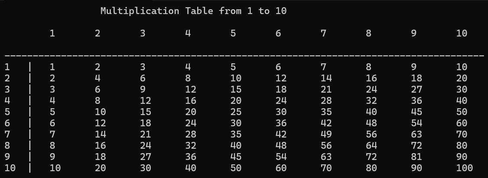

# Challenge 01: Formatted Multiplication Table in C++

## 📝 Description
A C++ console application that generates a clean, well-aligned multiplication table from 1 to 10. The main challenge of this exercise was handling column alignment dynamically—specifically ensuring that two-digit numbers (like 10) do not break the vertical borders (`|`) and spacing of the table.

## 🚀 Features & Clean Code Practices
* **Modular Design:** Divided the logic into distinct, single-responsibility functions (`printTableHeader`, `printTableBody`, and `separator`).
* **Dynamic Alignment:** Implemented the `separator()` function to adjust spacing conditionally based on whether the number is single or double-digit.
* **Readability:** Followed clean code naming conventions for variables and functions.

## 📸 Output Preview
Here is how the table looks when executed:



*(Note: Replace "image_36375f.png" with the actual path/name of your image inside the repository)*

## 🛠️ How to Run
To run this project locally, make sure you have a C++ compiler installed (like GCC/MinGW), then run:

```bash
g++ main.cpp -o main
./main
